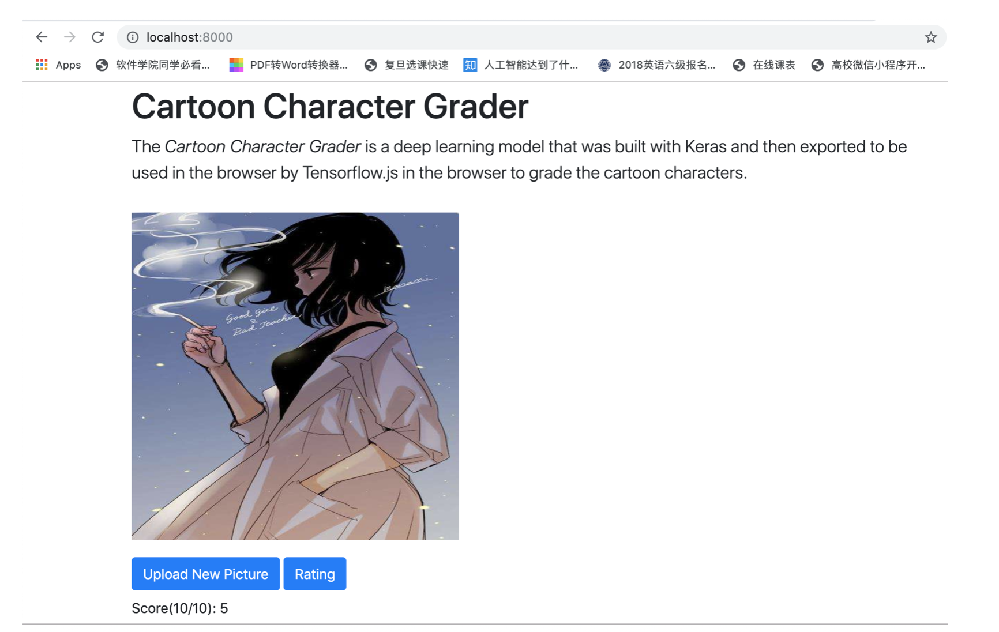

# Cartoon Character Grader with Tensorflow.js

## 概述

To grade the appearance of any cartoon character inside any browser. The classifier uses a pre-trained model built with Keras that was then exported to Tensorflow.js.

一款给动漫人物颜值打分的应用。该模型属于监督学习，CNN根据数据集中对不同风格/类型图片的不同预分值（label）建立对不同图片的颜值偏好，从而形成对颜值的判断。

## Getting Started

- `python3 -m http.server`

- Open your browser to [localhost:8000](http://localhost:8000/)

步骤
1.clone该项目

2.进入主目录，通过命令python3 -m http.server开启服务器

3.浏览器输入localhost:8000，成功显示网页

4.上传动漫人物图片，点击Rating进行智能颜值打分

5.屏幕上出现预测的分值，十分为满分。

## Built With

* [Tensorflow.js](https://www.tensorflow.org/js)
* [Keras](https://www.tensorflow.org/guide/keras)
* [Twitter Bootstrap](http://getbootstrap.com/)

## Dataset数据集

鸣谢https://blog.csdn.net/kurumi233/article/details/79368854z 中作者（改造汽水侠2号）提供的上百张动漫人物（女性图片）

数据来源：https://pan.baidu.com/s/1bpOBUAr 提取码：2nw9

        由于相关题材较为新颖，网上并没有更大规模的数据集，因此本案例中的数据集仅有上百张图片，会考虑在之后的版本进行数据集规模的增加与模型的重训练。对于这些图片，我私人根据自己的颜值打分习惯（譬如：萝莉<元气少女<御姐<成熟女性）进行初步打分，同时根据这一规则也可更方便地验证模型的准确率。当然，日后若真正投入大规模实际应用，需要有更具统计学意义的打分数据以表示大众的审美需求，且需要对应不同群体进行模型数据的更改；同时，图片也可不仅仅是动漫人物，可以扩展延伸到现实人物图片（但要考虑到图片数据集的不侵权性）。

## 模型训练与转换

       主要使用Keras进行模型的构建，使用了经典的卷积神经网络；训练完成之后，将模型转换为tensorflowjs所支持的图层格式，到服务器上进行部署。

